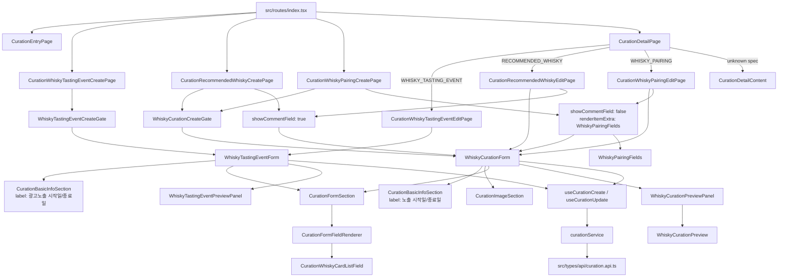

# Curation V2 Component Structure

큐레이션 v2 화면은 spec code별 page component가 presentation 조립을 맡고, 저장 폼과 API 계층은 공유한다.

## Entry Points

- 시음회 생성: `src/pages/curation/whisky-tasting-event/CurationWhiskyTastingEventCreate.tsx`
- 시음회 수정: `src/pages/curation/whisky-tasting-event/CurationWhiskyTastingEventEdit.tsx`
- 추천 위스키 생성: `src/pages/curation/whisky-curation/CurationRecommendedWhiskyCreate.tsx`
- 추천 위스키 수정: `src/pages/curation/whisky-curation/CurationRecommendedWhiskyEdit.tsx`
- 위스키 페어링 생성: `src/pages/curation/whisky-curation/CurationWhiskyPairingCreate.tsx`
- 위스키 페어링 수정: `src/pages/curation/whisky-curation/CurationWhiskyPairingEdit.tsx`

## Shared Layers

- `WhiskyTastingEventCreateGate`, `WhiskyCurationCreateGate`: spec list/detail loading and blocking states.
- `WhiskyTastingEventForm`, `WhiskyCurationForm`: create/update mutation and common form layout.
- `CurationBasicInfoSection`: shared basic fields. Tasting event keeps ad exposure copy; recommendation and pairing override to plain exposure copy.
- `CurationFormSection` and `CurationFormFieldRenderer`: JSON schema-derived payload fields.
- `curation.api.ts` -> `curation.service.ts` -> `useCurations.ts`: API type, service, TanStack Query hook ownership.
